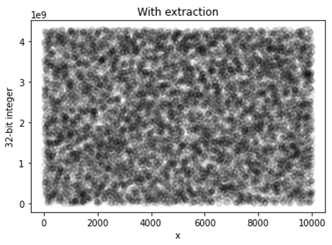

########################
Qiskit RNG (|version|)
########################

.. caution::

  This package is currently provided in beta form and heavy modifications to
  both functionality and API are likely to occur.

Qiskit RNG is a collaboration between `Cambridge Quantum Computing <https://cambridgequantum.com/>`_ (CQC)
and `IBM Quantum <https://www.ibm.com/quantum-computing/>`_ 
for generating certified quantum randomness using IBM Quantum systems running three-qubit
GHZ states with random X- and Y-measurements.  Provided that the state is tripartite entangled,
as measurement by a violation of the Mermin inequality (:math:`x,y\in \{1,2\}`):

.. math::

   M_{\rm obs} = \langle A_{1}B_{1}C_{1}\rangle - \langle A_{1}B_{2}C_{2}\rangle - \langle A_{2}B_{1}C_{2}\rangle - \langle A_{2}B_{2}C_{1}\rangle  \le 2,

the measured output can be certified quantum random for values :math:`2\sqrt{2} \le M_{\rm obs} \le 4`; the underlying
state was truly tripartite entangled.  The maximum value :math:`M_{\rm obs} = 4` indicates maximum randomness, and
and that the measurement outcomes are uniformly random. These "raw bits" are passed through a two-source randomness extractor
that creates a reduced length uniform random distribution (if :math:`M_{\rm obs} \neq 4`) of bits.

Further technical details maybe found in:
`Foreman et al., "Practical randomness and privacy amplification", arXiv:2009.06551 <https://arxiv.org/abs/2009.06551>`_.

``qiskit_rng`` has passed the following RNG test suites:

- `Dieharder <https://webhome.phy.duke.edu/~rgb/General/dieharder.php>`_

- `NIST Statistical Test Suite <https://csrc.nist.gov/projects/random-bit-generation/documentation-and-software>`_

.. toctree::
  :maxdepth: 2
  :hidden:

  Installation <install.rst>
  Usage <usage.rst>
  API reference <api.rst>

Quick start
-----------

.. code-block:: python

  from qiskit import IBMQ
  from qiskit_rng import Generator

  IBMQ.load_account()
  rng_provider = IBMQ.get_provider(hub='qrng')
  backend = rng_provider.backends.ibmq_ourence

  generator = Generator(backend=backend)
  result = generator.sample(num_raw_bits=1024).block_until_ready()

  extractor = rng_provider.random.cqc_extractor
  extractor_params = result.get_cqc_extractor_params()
  random_bits = extractor.run(*extractor_params)

License
-----------
Qiskit RNG is provided under the `Apache 2 license <https://www.apache.org/licenses/LICENSE-2.0.html>`_.

.. Hiding - Indices and tables
   :ref:`genindex`
   :ref:`modindex`
   :ref:`search`
